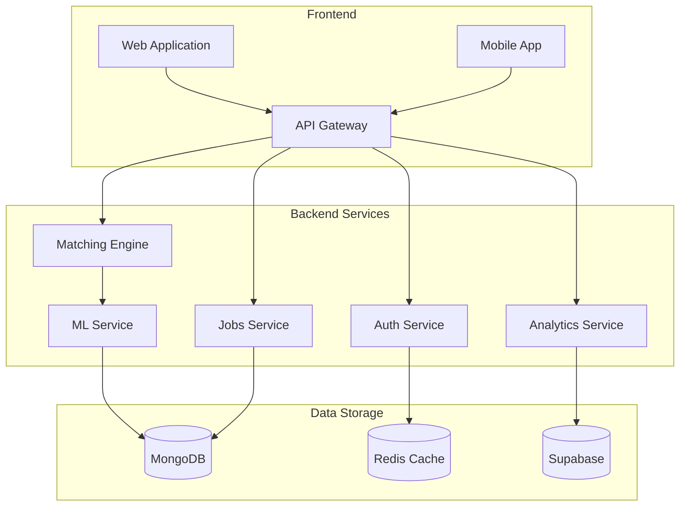

# LiftGo - AI Powered Job Search Platform

## 📝 Description
LiftGo is an advanced AI-powered job search platform that connects job seekers with relevant positions using sophisticated matching algorithms. The platform leverages artificial intelligence to optimize the job search and recruitment process.

## ✨ Key Benefits
- **Faster Job Search** - AI algorithm reduces time to find suitable positions
- **Smart Matching** - Advanced candidate-job matching analysis
- **Automation** - Automated recommendations and new opportunity notifications
- **Personalization** - Tailored suggestions based on experience and preferences

## 🎯 Target Users
- **Job Seekers** - Easy job search and application
- **Employers** - Efficient candidate search and verification
- **Recruitment Agencies** - Candidate management tools
- **Career Counselors** - Platform for guidance and progress tracking

## 🚀 Core Features

### For Job Seekers
- AI-powered job search and matching
- Smart filtering and position recommendations
- Advanced resume analysis algorithms
- Personalized career advice
- Job application tracking
- Automated cover letter generation
- LinkedIn profile integration

### For Employers
- Job posting and management
- AI candidate analysis
- Candidate communication tools
- Statistics and analytics
- ATS (Applicant Tracking System)
- HR system integration

## 💻 Technical Requirements
- Node.js 16+
- MongoDB 5.0+
- Python 3.8+ (for AI components)
- Docker (optional)
- Redis (for caching)

## 🏗️ System Architecture

### Technology Stack
- Frontend: Next.js, React Native
- Backend: Node.js, Python (AI/ML)
- Database: Supabase, MongoDB
- Cache: Redis
- AI: OpenAI, Pinecone
- Authentication: Supabase Auth
- Payments: Stripe

### Infrastructure Diagram


## 🛠️ Installation and Setup

### Local Development
```bash
# Clone repository
git clone https://github.com/yourusername/liftgo.git

# Navigate to project directory
cd liftgo

# Install dependencies
npm install

# Configure environment
cp .env.example .env
# Edit .env with appropriate values

# Start MongoDB (if using Docker)
docker-compose up -d mongodb

# Run development server
npm run dev
```

### Production Deployment
```bash
# Install production dependencies
npm install --production

# Build application
npm run build

# Start production server
npm start
```

## ⚙️ Configuration
Key settings in .env file:
```
DATABASE_URL=mongodb://localhost:27017/liftgo
SUPABASE_URL=your_supabase_url
SUPABASE_ANON_KEY=your_supabase_key
OPENAI_API_KEY=your_openai_key
STRIPE_SECRET_KEY=your_stripe_key
PINECONE_API_KEY=your_pinecone_key
REDIS_URL=redis://localhost:6379
```

## 🔒 Security Features
- Data encryption
- JWT authentication
- Rate limiting
- GDPR compliance
- Regular security audits

## 💳 Subscription Plans

### Stripe Integration
```javascript
const stripe = require('stripe')(process.env.STRIPE_SECRET_KEY);

const createSubscription = async (customerId, priceId) => {
  const subscription = await stripe.subscriptions.create({
    customer: customerId,
    items: [{ price: priceId }],
    payment_behavior: 'default_incomplete',
    expand: ['latest_invoice.payment_intent'],
  });
  return subscription;
};
```

### Subscription Tiers
- **Free Tier**
  - Basic functionality
  - Limited applications
  - No AI features

- **Pro Tier**
  - Unlimited applications
  - AI match scoring
  - Premium support

- **Enterprise Tier**
  - All Pro features
  - Dedicated account manager
  - Custom AI models
  - API access

## 🔐 Authentication & Database

### Supabase Auth Setup
```typescript
import { createClient } from '@supabase/supabase-js';

const supabase = createClient(
  process.env.NEXT_PUBLIC_SUPABASE_URL,
  process.env.NEXT_PUBLIC_SUPABASE_ANON_KEY
);

export const signInWithGoogle = async () => {
  const { data, error } = await supabase.auth.signInWithOAuth({
    provider: 'google',
    options: {
      redirectTo: `${window.location.origin}/auth/callback`,
    },
  });
  return { data, error };
};
```

### Database Schema
```sql
-- Users table
create table public.profiles (
  id uuid references auth.users on delete cascade,
  full_name text,
  avatar_url text,
  updated_at timestamp with time zone,
  primary key (id)
);

-- Jobs table
create table public.jobs (
  id uuid default uuid_generate_v4(),
  title text,
  company text,
  description text,
  salary_range text,
  location text,
  requirements text[],
  created_at timestamp with time zone default timezone('utc'::text, now()),
  primary key (id)
);
```

## 🤖 AI Features

### OpenAI Integration
```typescript
import { OpenAI } from 'openai';

const openai = new OpenAI({
  apiKey: process.env.OPENAI_API_KEY,
});

// CV Analysis
async function analyzeCV(cvText: string) {
  const completion = await openai.chat.completions.create({
    model: "gpt-4",
    messages: [
      {
        role: "system",
        content: "Analyze the resume and extract key skills, experiences, and improvement recommendations."
      },
      {
        role: "user",
        content: cvText
      }
    ],
    temperature: 0.7,
  });
  return completion.choices[0].message;
}
```

### AI Capabilities
- **Resume Analysis**
  - Skill extraction
  - Achievement identification
  - Improvement recommendations

- **Job Matching**
  - Multi-dimensional matching
  - Criteria weighting
  - Contextual analysis

- **Career Guidance**
  - Personalized career planning
  - Skill gap analysis
  - Learning recommendations

### Vector Search
```typescript
import { PineconeClient } from '@pinecone-database/pinecone';

const pinecone = new PineconeClient();
await pinecone.init({
  environment: process.env.PINECONE_ENVIRONMENT,
  apiKey: process.env.PINECONE_API_KEY,
});

// Semantic job search
async function semanticJobSearch(query: string) {
  const queryEmbedding = await generateEmbedding(query);
  const index = pinecone.Index('jobs');
  
  const searchResults = await index.query({
    vector: queryEmbedding,
    topK: 10,
    includeMetadata: true,
  });
  return searchResults;
}
```

## 📚 API Documentation
API documentation available at `/api/docs`

## 🧪 Testing
```bash
# Run all tests
npm test

# Run specific tests
npm test -- --grep "API tests"

# Generate coverage report
npm run test:coverage
```

## 📈 Analytics
- User engagement metrics
- Job matching success rates
- Platform performance
- Market trends

## 🌐 Internationalization
- 🇺🇸 English
- 🇸🇮 Slovenian
- 🇩🇪 German
- Additional languages in development

## 📱 Mobile App
- Push notifications
- Quick apply
- Document scanning
- Application tracking

## 📄 License
MIT License - see [LICENSE.md](LICENSE.md) for details

## 🤝 Support
- 📧 Email: support@liftgo.com
- 💬 Discord: [Liftgo Community](https://discord.gg/liftgo)
- 📚 Documentation: [docs.liftgo.com](https://docs.liftgo.com)
- 🎫 Issue tracker: [GitHub Issues](https://github.com/yourusername/liftgo/issues)

## 📊 Project Status


[](https://opensource.org/licenses/MIT)
