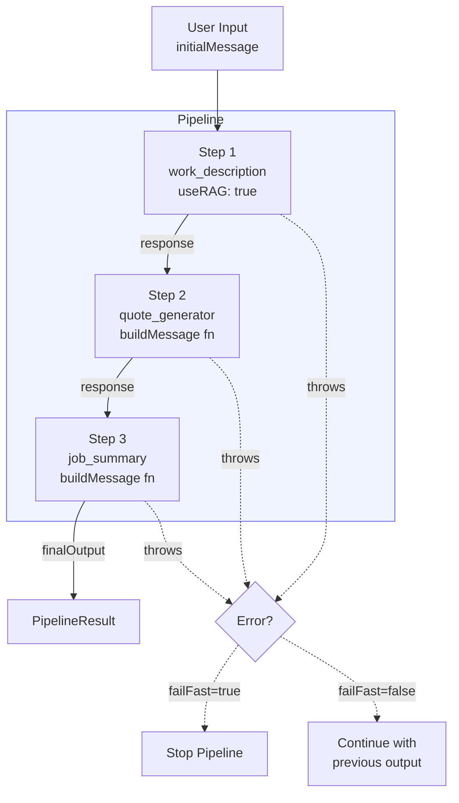
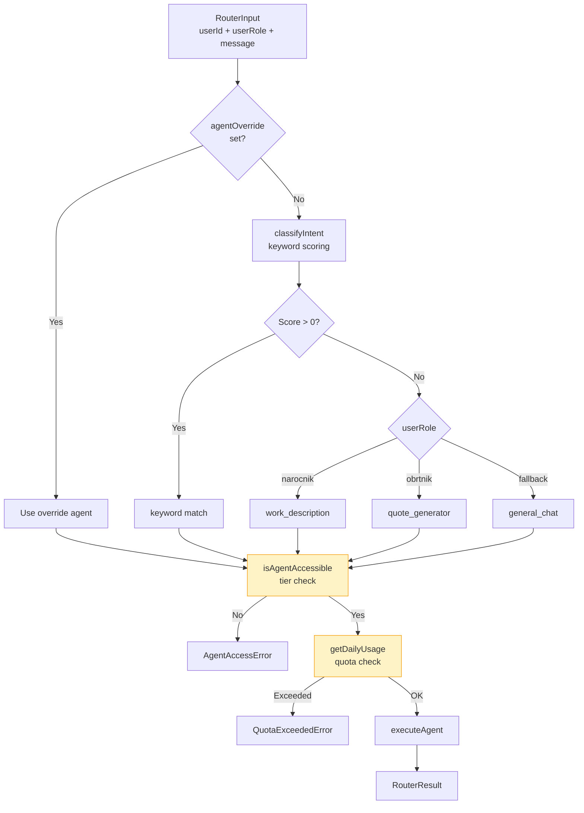
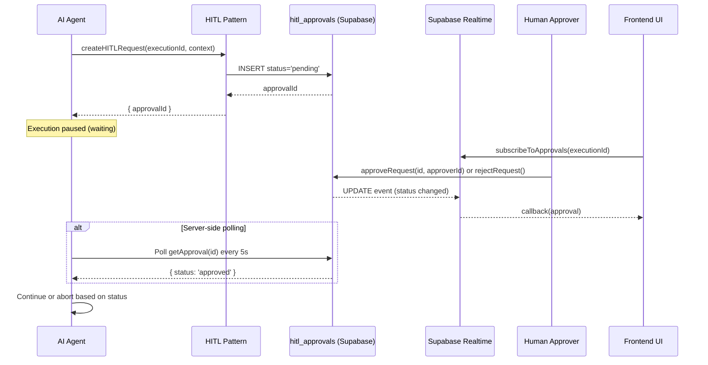
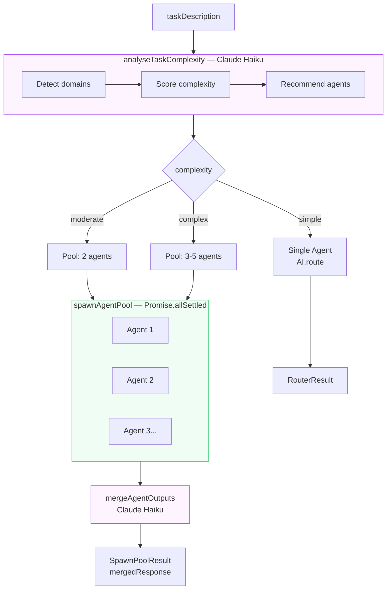
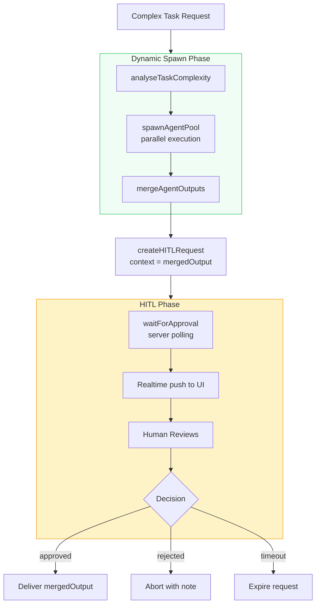
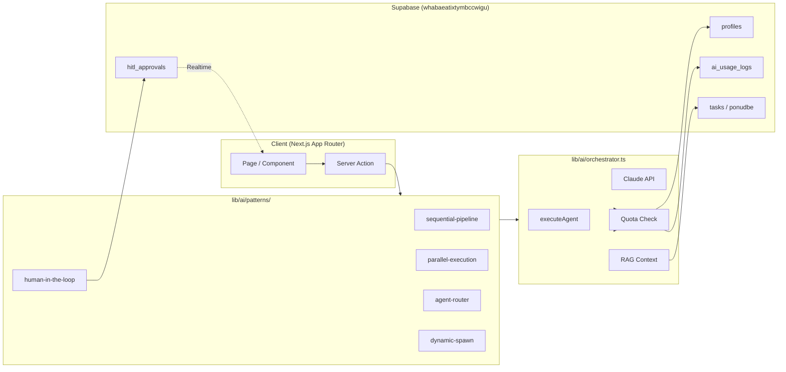
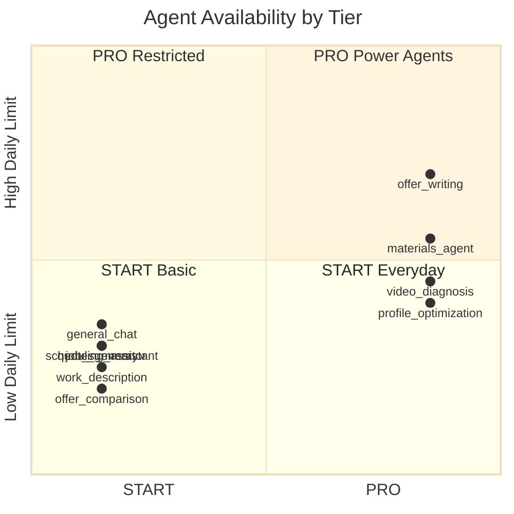

# LiftGO AI Patterns v2.0 — Architecture Diagrams

Mermaid diagrams showing the architecture of all five AI execution patterns.

---

## Pattern 1: Sequential Pipeline



---

## Pattern 2: Parallel Execution

```mermaid
flowchart TD
    IN[Parallel Tasks Array] --> BATCH

    subgraph BATCH[Promise.allSettled]
        direction LR
        A1[quote_generator]
        A2[materials_agent]
        A3[job_summary]
    end

    BATCH --> COL[Collect Results]

    COL --> F[fulfilled[]]
    COL --> R[rejected[]]

    F --> M[Metrics\ntotalCost\ntotalTokens]
    F --> MAP[results Record\nlabel → result]

    style BATCH fill:#f0fdf4,stroke:#22c55e
```

---

## Pattern 3: Agent Router



---

## Pattern 4: Human-in-the-Loop



---

## Pattern 5: Dynamic Spawn



---

## Combined: HITL + Dynamic Spawn



---

## System Architecture: Data Flow



---

## Subscription Tier Access Matrix


